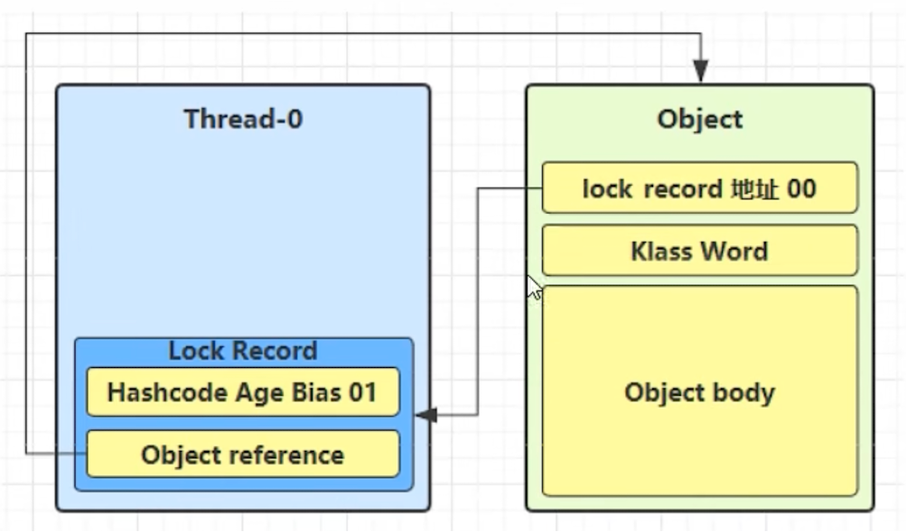

# 1. 共享模型之管程
## 1.1 共享带来的问题
两个线程对初始值为0的静态变量，一个做自增，一个做自减，各做5000次，结果是0吗？

### 1.1.1 问题分析

以上的结果可能是正数、负数、0，因为Java中对静态变量的自增，并不是原子操作，要彻底理解，需要从字节码来进行分析
例如对于i++而言（i为静态变量），实际会产生如下的jvm字节码指令：

```
getstatic i // 获取静态变量i的值
iconst_1    // 准备常量1
iadd        // 自增
putstatic i // 将修改后的值存在静态变量i
```

而Java的内存模型如下，完成静态变量的自增，需要在主存和工作内存之间完成数据的交换

根本原因：线程上下文切换引起的指令交错执行

### 1.1.2 临界区

* 一个程序运行多个线程本身是没有问题的
* 问题出在多个线程访问共享资源
  * 多个线程读共享资源也没有问题
  * 在多个线程对共享资源读写操作时发生指令交错，就会出现问题
* 一段代码内如果存在对共享资源的多线程读写操作，称这段代码为临界区

### 1.1.3 竟态条件
多个线程在临界区执行，由于代码的执行序列不同而导致结果无法预测，称之发生了竟态条件

## 1.2 synchronized解决方案
### 1.2.1 应用之互斥

为了避免临界区的竟态条件发生，有多种手段可以达成目的
* 阻塞式的解决方案：synchronized,Lock
* 非阻塞式的解决方案：原子变量

synchronized,俗称【对象锁】，它采用互斥的方式让同一时刻至多只有一个线程可以持有对象锁，其他线程再想获取这个对象锁就会阻塞。这样就可以保证拥有对象锁的线程可以安全的执行临界区的代码，不用担心线程上下文切换

> **注意**：
> 
> 虽然Java中互斥和同步都可以采用synchronized关键字来完成，但还是有区别的
> * 互斥是保证临界区的竟态条件发生，同一时刻只有一个线程可以执行临界区代码
> * 同步是由于线程执行的先后、顺序不同，需要一个线程等待另外一个线程运行到某个点

### 1.2.2 语法
```
synchronized(对象) { // 线程1（获取锁），线程2（blocked）
    临界区
}
```
synchronized实际是用对象锁保证了临界区内代码的原子性，临界区的代码对外是不可分割的，不会被线程切换所打断。

### 1.2.3 synchronized加锁的四种方式
```
class Test {
    public synchronized void test() {
        
    }
}
等价于
class Test {
    public void test() {
        synchronized(this) {
            
        }
    }
}
```

```
class Test {
    public synchronized static void test() {
        
    }
}
等价于
class Test {
    public static void test() {
        synchronized(Test.class) {
            
        }
    }
}
```

## 1.3 变量的线程安全分析
### 1.3.1 成员变量和静态变量是否线程安全？
* 如果它们没有共享，则线程安全
* 如果它们被共享了，根据它们的状态是否能够改变，又分两种情况
  *   如果只是读操作，则线程安全
  *   如果有读写操作，则这段代码是临界区，需要考虑线程安全

### 1.3.2 局部变量是否线程安全？
* 局部变量是线程安全的
* 但局部变量引用的对象则未必
  *   如果该对象没有逃离方法的作用访问，它是线程安全的
  *   如果该对象逃离方法的作用范围，需要考虑线程安全

### 常见的线程安全类
* String
* Integer
* StringBuffer
* Random
* Vector
* Hashtable
* java.util.concurrent包下的类

这里说的线程安全是指，多个线程调用它们同一个实例的某个方法时，是线程安全的。也可以理解为：
* 它们的每个方法都是原子的
* 但注意它们多个方法组合不是原子的

## 1.4 Monitor概念
### 1.4.1 java对象头
以32位虚拟机为例
普通对象

数组对象

其中Mark Word结构如下：


### 1.4.2 Monitor（锁）

Monitor被翻译是监视器或者管程，操作系统级别的对象

每个Java对象都可以关联一个Monitor对象，如果使用synchronized给对象加锁（重量级）后，该对象头的Mark Word中就被设置指向Monitor对象的指针

Monitor的结构如下：

* 刚开始Monitor中的Owner为null
* 当Thread-2执行synchronized(obj)就会将Monitor的所有者Owner置为Thread-2，Monitor中只能有一个Owner
* 在Thread-2上锁的过程中，如果Thread-3、Thread-4、Thread-5也来执行synchronized(obj)，就会进入EntryList BLOCKED
* Thread-2执行完同步代码块的内容，然后唤醒EntryList中等待的线程来竞争锁，竞争的时候是非公平的
* 图中WaitSet中的Thread-0、Thread-1是之前获取过锁，但条件不满足进入WAITING状态的线程，后面讲wait-notify时会分析

> **注意**
> * synchronized必须是进入同一个对象的monitor才会有上述效果
> * 不加synchronized的对象不会关联monitor，不遵守以上规则

### 1.4.3 原理之synchronized
#### 1.4.3.1 轻量级锁
轻量级锁的使用场景：如果一个对象虽然有多线程访问，但多线程访问的时间是错开的（也就是没有竞争），那么可以使用轻量级锁来优化。

轻量级锁对使用者来说是透明的，即语法仍然是synchronized

* 创建锁记录（Lock Record）对象，每个线程的栈帧都会包含一个锁记录的结构，内部可以存储锁定对象的Mark Word
 
* 让锁记录中的Object reference指向锁对象，并尝试用cas替代Object的Mark Word,将Mark Word的值存入锁记录
 
* 如果cas替换成功，对象头中存储了锁记录地址和状态00，表示由该线程给对象加锁，这时图示如下：

* 如果cas失败，有两种情况
  * 如果是其他线程已经持有了该Object的轻量级锁，这时表面有竞争，进入锁膨胀过程
  * 如果是自己执行了synchronized锁重入，那么再添加一条Lock Record作为重入的计数

* 当退出synchronized代码块（解锁时）如果有取值为null的锁记录，表示有重入，这时重置锁记录，表示重入计数减一

* 当退出synchronized代码块（解锁时）锁记录的值不为null，这时使用cas将Mark Word的值恢复给对象头
  * 成功，则解锁成功
  * 失败，说明轻量级锁进行了锁膨胀已经升级到重量级锁，进入重量级锁解锁流程


